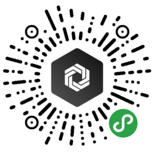

  

<h1 align="center">Thoughts Lab</h1>

🤯 Thoughts Lab 是基于 uni-app 开发的『工具集小程序』，采用通用型分层架构，支持多端发布、跨框架迁移。

目前共有一款 MVP 阶段的信息发布和浏览应用 —— Poster，支持发布、查看、分类、移除、添加图片等操作，为了保障所发布信息的可用性和信息交换的安全性，应用接入了基于校园邮箱的学生身份认证系统，每个人最多同时可发布不超过 10 条的 poster，应用场景自然也是校园。

Thoughts Lab 开发的应用都将以校园和日常生活为背景，旨在为同学们带来哪怕一丁点的效率和体验的提升。同名微信小程序是我为中国传媒大学的同学们部署的实例，大家可以搜索体验。同时，我也深知，凭一己之力难以将用户数提升到一个非常可观的量级，这样的发展方向也不是我向往的。反复思量，我决定将这个项目开源，并欢迎全国各大高校的同学，在自己所在的学校或社区进行实例化部署上线，为周围的同学提供“便捷”的一项选择。也欢迎各位有兴趣的同学参与到项目中来，跟我一样，为一个长远的目标贡献自己的一份力量。

对于中国传媒大学 Thoughts Lab 实例的运营，我承诺：

- 绝对不会在应用的主体部分添加任何的第三方广告，根据我的经验，单纯为了利益随意植入的广告不仅是广告主的损失，更是对用户的极大不敬；
- 应用不会在任何未经允许的情况下收集用户的个人信息，哪怕是昵称和头像，所有的使用数据，都将会在使用完毕之后第一时间删除；

收益并不是一件难以启齿的事情，对于开源项目来说，一味靠爱发电是不持久的。我不反对、也将会在应用的次要位置设置单独的赞助和赞赏通道。我希望并相信，所有的用户都会真诚地为自己认可的项目或作品提供支持与鼓励，好的应用生态需要开发者和所有用户的共同努力。

## Details

## Instance

<table>
  <tbody>
    <tr>
      <td align="center" valign="middle">
        
        
中国传媒大学

      </td>
      <td align="center" valign="middle">
        
        
……

      </td>
      <td align="center" valign="middle">
        
        
……

      </td>
    </tr>
  </tbody>
</table>

## Communities

- 中传实例『吐个槽』社区 - [链接](https://support.qq.com/products/102267)

## Documentation

项目的所有文档，请查看 `./docs` 目录，其中包括：

- [Getting Started](./docs/getting_started.md) - 如何下载、开发并部署
- [Directory Structure](./docs/directory_structure.md) - 项目结构
- [Todos](./docs/todos.md) - 开发计划
- [Architecture](./docs/architecture.md) - **开发架构**
- [Constructure](./docs/constructure.md) - 项目构建详情
- [Contributing](./docs/contributing.md) - 参与贡献

> 项目伊始，部分文档还在完善中，近期如有不便之处，还请诸位多多关注。

## Built With

- [uni-app](https://github.com/dcloudio/uni-app) - The miniprogram framework used 🤞

## Author

- **Cigaret** - *Undergraduate of CUC* - kcigaret@outlook.com

## License

This project is licensed under the **GPL-3.0** License - see the [LICENSE](LICENSE) file for details.
